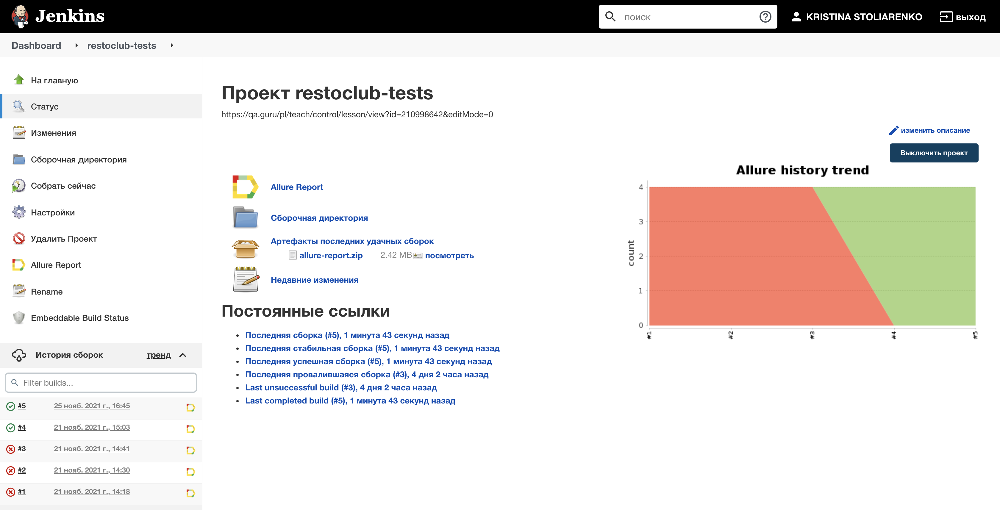
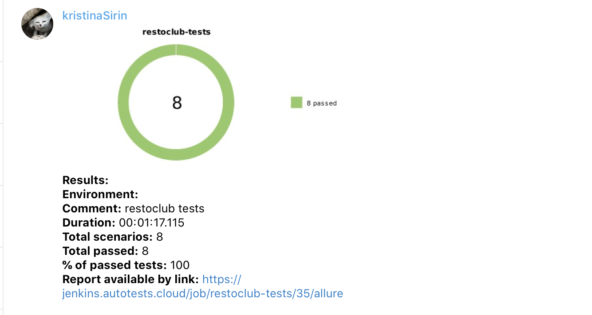
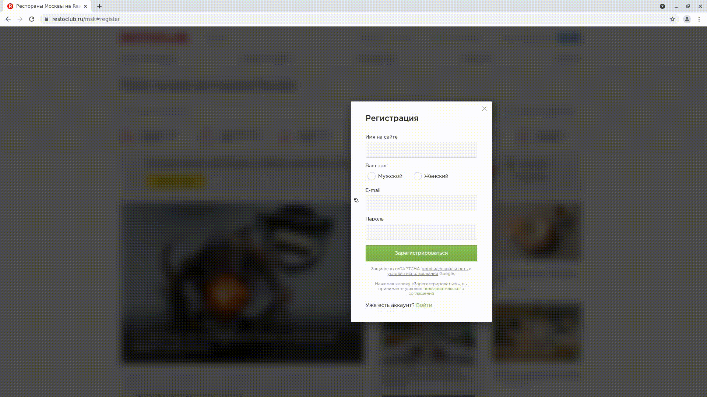

# :plate_with_cutlery: Автотесты для сайта restoclub.ru

 

## :stethoscope: Стек:
| GitHub | IDEA | Java | Junit5 | Gradle | Selenide | Selenoid | Allure Report | Allure TO | Jenkins | Jira |
|:--------:|:-------------:|:---------:|:-------:|:----:|:------:|:----:|:----:|:------:|:------:|:--------:|
|  |  |  |  |  |  |  |  |  |  |  |
___

## Для запуска тестов используются команды:

Если файл local.properties заполнен, то для запуска тестов необходимо выполнить команду:
```bash
gradle clean test
```
Если файл local.properties не заполнен, то для запуска тестов необходимо выполнить команду:
```bash
gradle clean test
-Dbrowser=${BROWSER}
-DbrowserVersion=${BROWSER_VERSION}
-DbrowserSize=${BROWSER_SIZE}
-DbrowserMobileView="${BROWSER_MOBILE}"
-DremoteDriverUrl=https://user1:1234@${REMOTE_DRIVER_URL}/wd/hub/
-DvideoStorage=https://${REMOTE_DRIVER_URL}/video/ -Dthreads=${THREADS}
```

Генерация отчета:
```bash
allure serve build/allure-results
```
___

## Запуск тестов происходит в CI [Jenkins](https://jenkins.autotests.cloud/job/restoclub-tests/)

 

## Уведомления о прохождение тестов отправляются в Telegram

 

## Видеотчет теста "Успешная авторизация"

 